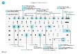

# Hurtigreferanse for tastatursnarveier – bare PC

#### Generelt

|Velg disse tastene|Hvis du vil gjøre dette|  
|-|-|
|<kbd>Alt</kbd>|Vis tilgangstaster for å navigere i handlingslinjen eller navigasjonsmenyen|
|<kbd>Alt</kbd>+<kbd>F2</kbd>|Vis og skjul faktaboksruten|
|<kbd>Alt</kbd>+<kbd>N</kbd>|Opprett en ny post|
|<kbd>Alt</kbd>+<kbd>Skift</kbd>+<kbd>N</kbd>|Lukk en nylig opprettet post, og opprett en ny|
|<kbd>Alt</kbd>+<kbd>O</kbd>|Legg til et nytt notat for den valgte posten|
|<kbd>Alt</kbd>+<kbd>Q</kbd>|Åpne **Fortell meg**|
|<kbd>Ctrl</kbd>+<kbd>Alt</kbd>+<kbd>Q</kbd>|Åpne **Søk etter poster**|
|<kbd>Alt</kbd>+<kbd>Up</kbd>|Åpne verktøytips eller valideringsfeil|
|<kbd>Alt</kbd>+<kbd>Pil ned</kbd>|Åpne en rullegardinmeny eller slå opp|
|<kbd>Ctrl</kbd>+<kbd>Alt</kbd><kbd>Pil ned</kbd>|Åpne kortet eller listesiden for en relatert oppføring filtrert etter verdien i oppslags- eller redigeringsfeltet|
|<kbd>Alt</kbd>+<kbd>T</kbd>|Åpne siden **Mine innstillinger**|
|<kbd>Alt</kbd>+<kbd>Skift</kbd>+<kbd>W</kbd>|Åpne gjeldende kort eller dokument i et nytt vindu|
|<kbd>Ctrl</kbd>+<kbd>Insert</kbd>|Sett inn en ny linje i et dokument|
|<kbd>Ctrl</kbd>-<kbd>Delete</kbd>|Slett linjen i et dokument, kladd og forslag.|
|<kbd>Ctrl</kbd>+<kbd>Skift</kbd>+<kbd>F12</kbd>|Maksimer linjeelementdelen på en dokumentside|
|<kbd>Ctrl</kbd>+<kbd>F1</kbd>|Åpne hjelperuten eller en hjelpeartikkel|
|<kbd>Ctrl</kbd>+klikk|Navigere når du tilpasser og egendefinerer|
|<kbd>Ctrl</kbd>+<kbd>O</kbd>|Bytt selskap eller miljø|
|<kbd>Skift</kbd>+<kbd>F12</kbd>|Åpne rolleutforskeren, en oversikt over funksjoner|
|<kbd>F5</kbd>/<kbd>Ctrl</kbd>+<kbd>F5</kbd>|Oppdatere / laste inn side på nytt|
|<kbd>Tab</kbd>/<kbd>Skift</kbd>+<kbd>Tab</kbd>|Flytte fokus til neste/forrige element|
|<kbd>F6</kbd>/<kbd>Skift</kbd>+<kbd>F6</kbd>|Flytt til neste hurtigfane/del|

#### Navigere og velge rader

|Velg disse tastene|Hvis du vil gjøre dette|
|-|-|
|<kbd>Home/End|Gå til første/siste felt|
|<kbd>Ctrl</kbd>+<kbd>Home</kbd>/<kbd>End</kbd>|Gå til første/siste rad|
|<kbd>Ctrl</kbd>+<kbd>opp</kbd>/<kbd>ned</kbd>|Navigere uten å tape merkingen|
|<kbd>Ctrl</kbd>+<kbd>A</kbd>|Merke alt|
|<kbd>Ctrl</kbd>+<kbd>Mellomrom</kbd>|Radvalg på/av|
|<kbd>Ctrl</kbd>/<kbd>Skift</kbd>+Klikk|Legge til raden(e) i utvalget|
|<kbd>Skift</kbd>+<kbd>opp</kbd>/<kbd>ned</kbd>|Legge til rad over/under utvalget|
|<kbd>Skift</kbd>+<kbd>Page Up</kbd>/<kbd>Down</kbd>|Velge synlige rader over/under|
|<kbd>Ctrl</kbd>+<kbd>Enter</kbd>|Fokuserer ut fra listen|

#### Kopier og lim inn

|Velg disse tastene|Hvis du vil gjøre dette|
|-|-|
|<kbd>Ctrl</kbd>+<kbd>C</kbd>/<kbd>V</kbd>|Kopier / lim inn rader|
|<kbd>F8</kbd>|Kopiere feltet over til gjeldende rad|

#### Søk, filtrer og sorter

|Velg disse tastene|Hvis du vil gjøre dette|
|-|-|
|<kbd>Alt</kbd>+<kbd>F7</kbd>|Sorter kolonne i stigende/synkende rekkefølge|
|<kbd>F3</kbd>|Slå søk på/av|
|<kbd>Skift</kbd>+<kbd>F3</kbd>|Vise/skjule filtreringsruten. fokusere på feltfiltre|
|<kbd>Alt</kbd>+<kbd>F3</kbd>|Filtrere på den valgte celleverdien|
|<kbd>Skift</kbd>+<kbd>Alt</kbd>+<kbd>F3</kbd>|Legg til filter for valgt felt|
|<kbd>Ctrl</kbd>+<kbd>Alt</kbd>+<kbd>Skift</kbd>+<kbd>F3</kbd>|Tilbakestill filtre|

#### Hurtigoppføring

|Velg disse tastene|Hvis du vil gjøre dette|
|-|-|
|<kbd>Ctrl</kbd>+<kbd>Skift</kbd>+<kbd>Enter</kbd>|Gå til neste hurtigoppføringsfelt utenfor en liste|
|<kbd>Enter</kbd>/<kbd>Skift</kbd>+<kbd>Enter</kbd>|Gå til neste/forrige hurtigoppføringsfelt|

##### Forhåndsvisning av rapport

|Velg disse tastene|Hvis du vil gjøre dette|
|-|-|
|<kbd>Ctrl</kbd>+<kbd>Home</kbd>/<kbd>End</kbd>|Gå til den første/siste siden|

#### Numerisk tastatur

|Velg disse tastene|Hvis du vil gjøre dette|  
|-|-|
|<kbd>Alt</kbd>+<kbd>desimalskilletegn</kbd>|Aktiver eller deaktiver desimalskilletegntasten på numerisk tastatur|

> [!TIP]
> Hvis du vil ha en grafisk, utskriftsvennlig versjon, velger du følgende bilde og laster ned PDF-filen.
>
> 

[!INCLUDE[footer-include](includes/footer-banner.md)]
