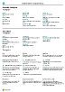

# Arbeide med [!INCLUDE[d365fin](includes/d365fin_md.md)]Working with [!INCLUDE[d365fin](includes/d365fin_md.md)]
Når du utfører forretningsoppgaver, arbeider du interaktivt med data på forskjellige måter, for eksempel for å opprette poster og skrive inn data, sortere og filtrere data, skrive merknader og skrive data til andre programmer.When performing business tasks, you interact with data in different ways, such as creating records and entering data, sorting and filtering data, writing notes, and outputting data to other applications.

Du kan for eksempel justere størrelsen på og plasseringen av sider, øke kolonnebredden og høyden på kolonneoverskrifter, og du kan endre sorteringen av data i kolonner.For example, you can adjust the size and position of any page, expand the width of columns and increase the height of column headers, and change the sorting of data in columns. Hvis du vil bruke det vannrette rullefeltet for å vise alle kolonner på en oversiktsside eller på dokumentlinjer, vil du se at det er en fryst loddrett rute for å hindre at bestemte kolonner ruller.And if you want to use the horizontal scroll bar to view all columns on a list page or on document lines, you will see that there is a vertical freeze pane to restrict some columns from scrolling.

> [!TIP]
> Hvis du vil ha en utskriftsvennlig overskrift over de mest brukte funksjonene, velger du følgende bilde og laster ned PDF-filen.For a print-friendly overview of the most used functions, choose the following image and download the PDF file.
>
> 

> [!NOTE]
> Du kan bruke andre generelle funksjoner som er mer firmarelaterte, i tillegg til de generelle grensesnittfunksjonene som er beskrevet i denne delen.In addition to the general UI functions described in this section, you can use other general functions that are more business-related. Hvis du vil ha mer informasjon, kan du se [Generelle forretningsfunksjoner](ui-across-business-areas.md).For more information, see [General Business Functionality](ui-across-business-areas.md).

Tabellen nedenfor inneholder noen av de generelle funksjonene med koblinger til emnene som beskriver dem.The following table lists some of the general functionality with links to topics that describe them.

| TilTo | SeSee |
| --- | --- |
|Søk etter en bestemt side, rapport, handling, hjelpeemne eller partnerutvidelse.Find a specific page, report, action, help topic, or partner extension. |[Finne sider og informasjon med Fortell megFinding Pages and Information with Tell Me](ui-search.md) |
|Få en oversikt over sider for rollen og andre roller, og gå til sider.Get an overview of pages for your role and for other roles and navigate to pages.|[Finne sider med rolleutforskerenFinding Pages with the Role Explorer](ui-role-explorer.md)|
| Filtrere data i visninger, rapporter og funksjoner ved å bruke spesielle symboler og tegn.Filter data in views, reports, or functions by using special symbols and characters. |[Sortere, søke etter og filtrere oversikterSorting, Searching, and Filtering Lists](ui-enter-criteria-filters.md) |
|Lær de mange generelle funksjonene som du kan bruke til å skrive inn data raskt og enkelt.Learn the many general functions that help you enter data in a quick and easy way.|[Skrive inn dataEntering Data](ui-enter-data.md)|
|Lær hvordan du raskt kopierer og limer inn dataene inkludert ved hjelp av tastatursnarveier.Learn how to quickly copy and paste data including by using keyboard shortcuts.|[Vanlige spørsmål for Kopiere og lime innCopying and Pasting FAQ](ui-copy-paste.md)|
| Vise eller prosessen data i et bestemt tidsrom.View or process data in specific date ranges. |[Arbeide med datoer og klokkeslett i kalenderenWorking with Calendar Dates and Times](ui-enter-date-ranges.md) |
| Se hvilke felt som må fylles ut.See which fields must be filled in. |[Registrere obligatoriske feltDetecting Mandatory Fields](ui-mandatory-fields.md) |
|Forstå hvordan datamaskinens regionale innstillinger påvirker brukergrensesnittet og hvordan du kan endre språket.Understand how the computer locale affects the user interface and the Help site and how to change the language.|[Endre språk og nasjonal innstillingChanging Language and Locale](about-locale-language.md)|
|Lær hvordan du samhandler med Excel fra nesten hvor som helst i [!INCLUDE[d365fin](includes/d365fin_md.md)]Learn how to interact with Excel from practically anywhere in [!INCLUDE[d365fin](includes/d365fin_md.md)]|[Vise og redigere i ExcelViewing and Editing in Excel](across-work-with-excel.md)|
|Legg ved filer, legg til koblinger eller skriv merknader på kort og dokumenter.Attach files, add links, or write notes on cards and documents.|[Behandle vedlegg, koblinger og merknader på kort og dokumenterManage Attachments, Links, and Notes on Cards and Documents](ui-how-add-link-to-record.md)|
| Endre grunnleggende innstillinger, for eksempel firma, arbeidsdato eller rollesenter.Change basic settings such as company, work date, and Role Center. |[Endre grunnleggende innstillingerChange Basic Settings](ui-change-basic-settings.md) |
|Bli varslet om bestemte hendelser eller endringer i statusen, for eksempel når du skal fakturere en kunde som har en forfalt saldo.Get notified about certain events or changes in status, such as when you are about to invoice a customer who has an overdue balance.|[Behandle varslerManage Notifications](ui-smart-notifications.md)|
| Endre hvilke og hvor grensesnittelementer skal vises for å etterkomme dine behov.Change which and where UI elements are shown to fit your preferences.|[Tilpasse arbeidsområdetPersonalize Your Workspace](ui-personalization-user.md) |
|Definer, forhåndsvis, skriv ut eller lagre rapporter, og definer og utfør kjørsler.Define, preview, print, or save reports and define and run batch jobs.|[Arbeide med rapporter, satsvise jobber og XML-porterWorking with Reports, Batch Jobs, and XMLports](ui-work-report.md)|
| Administrere innhold og format av rapporter og dokumenter, blant annet hvilke datafelt i et rapportdatasett som skal vises i rapporten, hvordan de er ordnet, samt tekststil, bilder og mer.Manage the content and format of reports and documents, including which data fields of a report dataset appear on the report and how they are arranged, text style, images, and more.|[Administrere rapport- og dokumentoppsettManaging Report and Document Layouts](ui-manage-report-layouts.md) |
|Lære om funksjoner som gjør [!INCLUDE[d365fin](includes/d365fin_md.md)] lett tilgjengelig for personer med funksjonshemminger.Learn about features and capabilities that make [!INCLUDE[d365fin](includes/d365fin_md.md)] readily available to people with disabilities.|[Tilgjengelighet og hurtigtasterAccessibility and Keyboard Shortcuts](ui-accessibility.md)|

## Navigere i Business CentralGetting Around in Business Central
Her er en kort video om hvordan du navigerer i [!INCLUDE[d365fin](includes/d365fin_md.md)].Here's a short video about how to get around in [!INCLUDE[d365fin](includes/d365fin_md.md)].

> [!VIDEO https://www.youtube.com/embed/zqz03iMihx0]

## Se ogsåSee Also
[Komme i gangGetting Started](product-get-started.md)  
[Definere Business CentralSetting Up Business Central](setup.md)  
[Generelle forretningsfunksjonerGeneral Business Functionality](ui-across-business-areas.md)  

## [!INCLUDE[d365fin](includes/free_trial_md.md)]  
## [!INCLUDE[d365fin](includes/training_link_md.md)]
